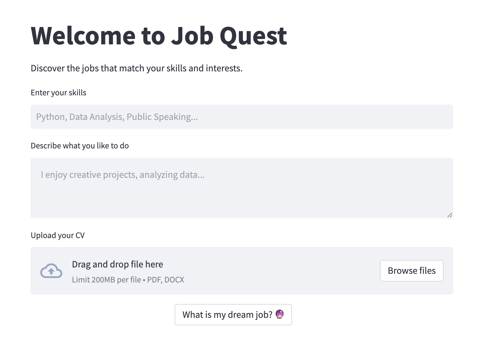

# Job Quest: Your AI Career Advisor

Job Quest is a tool designed to bridge the gap between skills and career opportunities. Leveraging advanced Natural Language Processing (NLP) and machine learning techniques, Job Quest provides personalized job role suggestions based on user-inputted skills, interests, and experience.

## Project Structure

```bash
./
├── api/              # API with Fast API
├── app/              # Streamlit app files and subdirectories
├── data/             # All datasets (raw and clean)
│   ├── raw_data/     # CSV and JSON file
│   └── clean_data/   # Parquet file create from raw_data with cleaning functions
├── drafts/           # Local folder to try
│   ├── notebooks/    # Jupyter notebooks for analysis and prototyping
│   └──  scripts/     # Scripts before putting it into scripts/ folder
├── scripts/          # All ML and DL logic to import into the API
│   ├── model         # Defining ML and DL models
│   ├── preprocessor  # Preprocess the clean_data for model training
│   └── cleaning      # Scripts to clean and concat the raw_data
├── .env.sample       # .env.sample to copy/paste and to rename .env
├── .envrc
├── .gitignore
├── .python-version
├── Dockerfile        # Configuration file for Docker
├── Makefile          # Makefile for
├── README.md
├── requirements.txt  # Python packages for the projects
└── setup.py
```

Each directory is structured to organize the project's components efficiently:

- `api/`: Contains all backend with Fast API components.
- `app/`: Holds the Streamlit frontend application code.
- `drafts/`: Includes all Jupyter notebooks for data exploration and model experimentation.
- `data/`: Stores the raw job description data and the cleaned data
- `scripts/`: Contains scripts for various automation tasks within the project.

## Features

- **Skill and Interest Input**: Users can input their skills and interests in natural language.
- **Industry Preferences**: Option to select preferred industries for job suggestions.
- **Resume Upload**: Users can upload their CV for a more comprehensive profile analysis.
- **Personalized Job Suggestions**: Tailored job role recommendations based on the processed inputs.

## Technology Stack

- **Frontend**: Streamlit
- **Backend**: Python, Machine Learning (Clustering, NER, Skill2Vec)
- **Libraries**: HuggingFace, LangChain

## Installation

Step-by-step instructions on how to install and run your project locally:

```bash
git clone https://github.com/Lightskyz/job-quest-app.git
cd job-quest-app
pip install -r requirements.txt
```

## Streamlit



---

## API (Work in progress)

### Prediction

- Denoted by `/predict`
- HTTP verb: `GET`

It should accepts the following query parameters

<br>

| Name | Type | Sample |
|---|---|---|
| body | string | `My main skills are python development, model tuning and MLOps pipeline` |

<br>

It should return the following JSON
```json
{
    [
      {
        'job_1': 0.999
      },
      {
        'job_2': 0.898
      },
      {
        'job_3': 0.76
      },
      {
        'job_4': 0.31
      }
    ]
}
```
